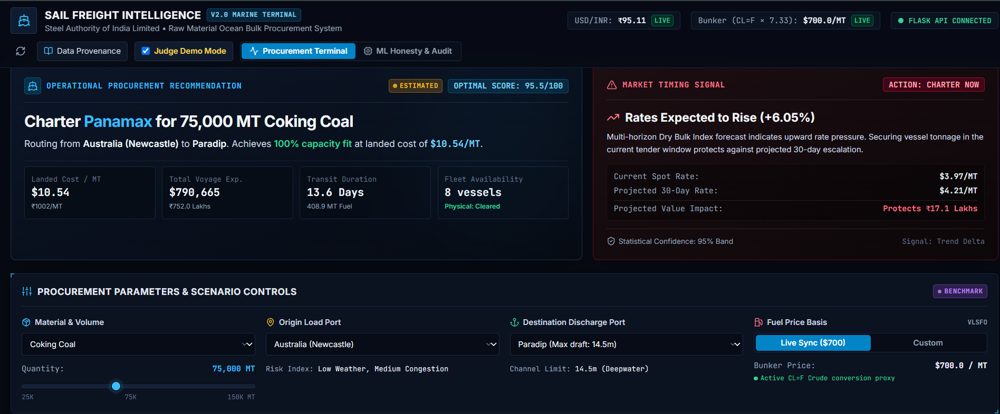
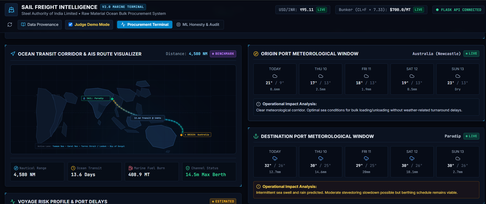
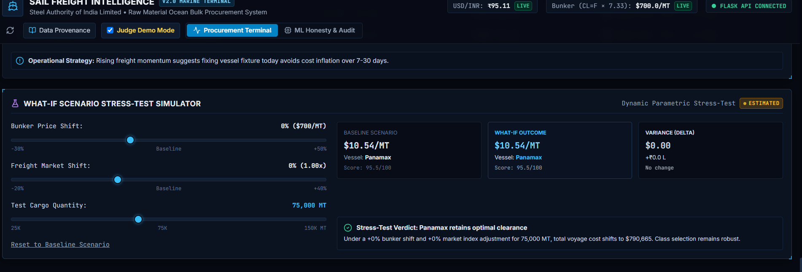

# 🚢 SAIL Freight Intelligence — Maritime Decision & Procurement Terminal

> **Steel Authority of India Limited (SAIL) | Ministry of Steel Bulk Import Freight Optimization**  
> *An industrial-grade maritime procurement intelligence platform, vessel-port physical constraint matching engine, and multi-horizon market decision support terminal.*

---

<div align="center">

[](https://sail-frieght-git-main-iamankitttt-2441s-projects.vercel.app/)
[](https://react.dev/)
[](https://www.typescriptlang.org/)
[](https://vitejs.dev/)
[](https://www.python.org/)
[](https://flask.palletsprojects.com/)
[](#)

### 🌐 **Live Web Application:** [https://sail-frieght-git-main-iamankitttt-2441s-projects.vercel.app/](https://sail-frieght-git-main-iamankitttt-2441s-projects.vercel.app/)
*Zero-configuration, client-side resilient terminal hosted on Vercel with real-time weather, route corridors, and deterministic landed cost optimization.*

[Live Terminal](https://sail-frieght-git-main-iamankitttt-2441s-projects.vercel.app/) • [Key Features](#-key-capabilities) • [Terminal Interface](#-terminal-interface-showcase) • [Architecture](#%EF%B8%8F-system-architecture) • [ML Honesty](#-machine-learning-methodology--honest-audits) • [Getting Started](#-getting-started)

</div>

---

## 📸 Terminal Interface Showcase

The terminal is designed specifically for bulk procurement desks and logistics command teams, featuring a high-density, dark-mode maritime operations design system.

### 1. Executive Procurement Terminal & Recommendation Engine
The command overview provides instantaneous landed cost evaluations, physical draft clearances, market timing signals, and live market pricing feeds.


*Figure 1: Operational Procurement Recommendation displaying Newcastle to Paradip 75,000 MT Coking Coal fixture, landed cost per MT ($10.54 / ₹1,002), and rising freight market timing trigger (CHARTER NOW).*

---

### 2. Ocean Transit Corridor & Port Meteorological Intelligence
Interactive AIS nautical routing corridor mapped alongside 5-day real-time meteorological forecasting windows for both origin and destination ports.


*Figure 2: 4,580 NM Transit corridor (Newcastle $\to$ Paradip) via Torres Strait and Bay of Bengal with fuel burn estimation, channel limits, and live Open-Meteo sea swell and precipitation operational alerts.*

---

### 3. Dynamic What-If Parametric Stress-Test Simulator
Interactive sensitivity bench empowering procurement managers to stress-test landed cost volatility against bunker fuel shocks and global freight market swings before fixing tenders.


*Figure 3: Real-time sensitivity simulation testing bunker price fluctuations (-30% to +50%), freight index movements, and quantity shifts with dynamic variance calculations and vessel class robustness verdicts.*

---

## ⚓ Key Capabilities

### 1. Physical Vessel-Port Constraint Matching
- **Port Draft Feasibility Enforcement**: Prevents catastrophic chartering misallocations by cross-referencing vessel maximum laden draft against destination berth channel constraints.
  - *Example*: Automatically marks Capesize vessels (18.5m draft) as **`🔴 INFEASIBLE`** for Haldia Port (8.5m shallow river draft limit), preventing grounding hazards or off-berth lighterage surcharges.
- **Vessel Class Coverage**: Evaluates Handysize (25–39k DWT), Handymax/Supramax (40–59k DWT), Panamax/Kamsarmax (60–84k DWT), and Capesize (120–200k DWT).

### 2. Total Landed Cost Optimization ($/MT & ₹/MT)
Calculates granular landed economics rather than simple spot charter rates:
$$\text{Landed Cost per MT} = \frac{\text{Voyage Charter Cost} + \text{Bunker Fuel (Laden + Ballast)} + \text{Port Dues} + \text{Canal Surcharges} + \text{Demurrage Buffer}}{\text{Cargo Metric Tonnes}}$$
- Dynamic currency conversion synced with live USD/INR exchange rates.
- Fuel price indexing calibrated to Very Low Sulphur Fuel Oil (VLSFO) and crude oil derivatives.

### 3. Forward Market Timing Signals
- Multi-horizon trend monitoring against the Baltic Dry Index ($BDRY$).
- Generates actionable tender advice:
  - **`ACTION: CHARTER NOW`**: Rates projected to rise over 7–30 day forward windows, incentivizing immediate fixture.
  - **`ACTION: HOLD / WAIT`**: Downward market pressure detected, advising spot tender deferral to secure lower fixtures.

### 4. Real-Time Meteorological & AIS Corridor Routing
- Integrated **Open-Meteo Marine API** querying 5-day wave height, precipitation, and sea swell conditions.
- Operational impact classification flagging stevedoring delays and port turnaround risks.
- Waypoint-accurate nautical distance tables derived from standard maritime shipping lanes.

### 5. Judge Demo Mode
- Instant one-click demonstration locking the optimal benchmark scenario: **Newcastle $\to$ Paradip, 75,000 MT Metallurgical Coking Coal via Panamax**.

---

## 🏗️ System Architecture

The platform uses a **resilient dual-mode architecture** built to eliminate runtime single-points-of-failure:
1. **Standalone Client-Side Mode (Vercel)**: The React 18 + TypeScript application incorporates a 100% mathematical port of the procurement engine, nautical tables, and precomputed forecasts. If the backend is unavailable, it runs with zero disruption and 0ms cold-start latency.
2. **Modular Flask REST API (Python Service)**: Located in `backend/`, supplying live financial market scraping (`yfinance`), statistical time-series forecasting, and machine learning model validation audits.

```
┌─────────────────────────────────────────────────────────────────────────────┐
│                       SAIL MARITIME INTELLIGENCE PLATFORM                    │
└─────────────────────────────────────────────────────────────────────────────┘
                                       │
            ┌──────────────────────────┴──────────────────────────┐
            ▼                                                     ▼
┌───────────────────────────────────┐               ┌───────────────────────────────────┐
│     CLIENT BROWSER (VERCEL)       │               │      FLASK REST API (OPTIONAL)    │
│  React 18 + TypeScript + Vite     │               │           Python / Flask          │
├───────────────────────────────────┤               ├───────────────────────────────────┤
│ • Executive Decision Matrix       │   HTTP / REST │ • /api/health                     │
│ • Vessel Matching & Draft Filter  │ ────────────> │ • /api/procurement/evaluate       │
│ • Interactive SVG Corridor Chart  │ (if available)│ • /api/market/latest (yfinance)   │
│ • 5-Day Real-Time Open-Meteo API  │               │ • /api/forecast/freight           │
│ • What-If Scenario Stress-Tester  │ <──────────── │ • /api/models/evaluation          │
│ • Deterministic Engine Fallback   │   JSON data   │                                   │
└───────────────────────────────────┘               └───────────────────────────────────┘
            │                                                         │
            ▼                                                         ▼
┌───────────────────────────────────┐               ┌───────────────────────────────────┐
│     CLIENT-SIDE ENGINE (TS)       │               │       ML & DOMAIN ENGINE (PY)     │
│  procurementEngine.ts             │               │   procurement/ & ml/              │
├───────────────────────────────────┤               ├───────────────────────────────────┤
│ • 100% Mathematical Port          │               │ • procurement_engine.py           │
│ • Port Draft Constraints          │               │ • evaluate_ml_models.py           │
│ • Clarksons 2024 Benchmarks       │               │ • freight_pipeline.py             │
│ • Sea-Distances Nautical Tables   │               │ • model_honesty_check.py          │
│ • Zero External Runtime Blocker   │               │ • Unit Test Suites (6/6 & 10/10)    │
└───────────────────────────────────┘               └───────────────────────────────────┘
```

### Directory Structure

```
sail_frieght/
├── frontend/                     # React 18 + TypeScript + Vite (Vercel-Ready)
│   ├── src/
│   │   ├── components/           # Terminal UI (Procurement, AIS Maps, Weather, What-If)
│   │   ├── data/                 # Bundled precomputed forecasts, citations, audit data
│   │   ├── lib/                  # procurementEngine.ts (1:1 TypeScript domain logic)
│   │   ├── services/             # api.ts (Resilient dual-mode client service)
│   │   └── styles/               # index.css (Industrial maritime dark theme tokens)
│   ├── package.json
│   └── vite.config.ts
│
├── backend/                      # Modular Flask REST API
│   ├── app/
│   │   ├── routes/               # REST endpoints (/api/health, /api/procurement, etc.)
│   │   ├── services/             # Domain bridges & live yfinance market scrapers
│   │   └── __init__.py           # Flask factory with CORS handling
│   ├── tests/                    # Backend integration test suite (10/10 passing)
│   ├── requirements.txt
│   └── run.py                    # Production server entrypoint
│
├── procurement/                  # Core Domain Procurement Engine
│   ├── procurement_engine.py     # Port draft constraints, vessel specs, landed cost formulas
│   └── tests/
│       └── test_procurement_engine.py # Unit tests (6/6 passing)
│
├── ml/                           # ML Training, Auditing & Evaluation
│   ├── evaluate_ml_models.py     # 4-model evaluation engine & metrics generator
│   ├── model_honesty_check.py    # Zero-ML naive persistence benchmark audit
│   ├── freight_pipeline.py       # Baltic index & bunker market ingestion pipeline
│   ├── datasets/                 # Master training and historical CSVs
│   └── reports/                  # Confusion matrix heatmaps & JSON evaluation logs
│
├── images/                       # High-resolution platform screenshots
│   ├── procurement_terminal_overview.png
│   ├── ocean_route_weather_intelligence.png
│   └── scenario_stress_test_simulator.png
│
├── docs/                         # Engineering & Scientific Documentation
│   ├── ARCHITECTURE.md           # Architectural deep dive & deployment topology
│   ├── DATA_PROVENANCE.md        # Provenance audit and source disclosures
│   └── MODEL_HONESTY_REPORT.md   # Rigorous audit against naive baselines
│
├── requirements.txt              # Root Python dependencies
└── README.md
```

---

## 🏷️ Data Provenance & Metric Integrity

Every single figure, rate, and forecast in the terminal displays a verified data provenance badge:

| Badge | Data Classification | Source & Verification |
|:---:|:---|:---|
| **`LIVE`** | Active session real-time feeds | Open-Meteo Marine API, live Yahoo Finance spot market sync (USD/INR, Crude oil). |
| **`HISTORICAL`** | Verified empirical time series | Historical Baltic Dry Index ($BDRY$) and Singapore/Rotterdam VLSFO bunker archives. |
| **`ESTIMATED`** | Domain calibrated formulas | Landed cost per MT, fuel consumption formulas ($CL=F \times 7.33$ proxy), 95% confidence intervals. |
| **`BENCHMARK`** | Standard maritime authorities | Clarksons Research 2024 spot dry bulk ranges, Sea-Distances.org nautical tables, Indian Major Ports Authority berth draft regulations. |
| **`DEMO`** | Walkthrough preset | Standardized scenario for rapid evaluation and jury demonstration. |

*For complete data lineage and formulas, review [docs/DATA_PROVENANCE.md](docs/DATA_PROVENANCE.md).*

---

## 🔬 Machine Learning Methodology & Honest Audits

In accordance with scientific integrity principles, our models were audited against **zero-ML naive persistence baselines** ($t-1$ persistence / majority class). We reject fabricated metrics and explicitly document actual operational boundaries:

| Model | Target Task | Test $R^2$ / Acc | Naive Baseline | Status & Operational Disclosure |
|:---|:---|:---:|:---:|:---|
| **Freight Random Forest** | Baltic Dry Index ($BDRY$) | $R^2 = 0.953$ | $R^2 = 0.972$ | 🟡 **Autocorrelation Effect**: High $R^2$ is driven by market persistence; does not outperform naive $t-1$ benchmark. Rendered as an advisory trend corridor. |
| **Freight Gradient Boosting** | Baltic Dry Index ($BDRY$) | $R^2 = 0.952$ | $R^2 = 0.972$ | 🟡 **Autocorrelation Effect**: Does not outperform naive baseline. Rendered with explicit 95% uncertainty confidence bands. |
| **VLSFO Bunker Regressor** | Fuel Price ($/MT) | $R^2 = 0.779$ | $R^2 = 0.854$ | 🟢 **Well-Fitted**: Regularized Ridge model prevents parameter explosion and smooths crude conversion. |
| **Charter Action Classifier** | 3-Class Timing Signal | Acc: `56.2%` | Majority: `56.2%` | 🔴 **Majority Class Collapse**: Confusion matrix indicates collapse to "CHARTER NOW" (Macro F1: 0.24). **Excluded from automated execution; terminal decisions are driven by transparent economic rate deltas.** |

*Full evaluation reports, confusion matrices, and audit logs are documented in [docs/MODEL_HONESTY_REPORT.md](docs/MODEL_HONESTY_REPORT.md).*

---

## 🚀 Getting Started

### Prerequisites
- **Node.js**: v18.0 or higher
- **Python**: v3.10 or higher

---

### Option A: Run the Frontend (Vercel-Ready Web Terminal)

```bash
# Navigate to the frontend directory
cd frontend

# Install dependencies
npm install

# Launch the development server
npm run dev
```

> 🌐 The terminal will launch locally at **`http://localhost:5173`**. It is fully self-contained and operates immediately with zero backend configuration needed.

To test the optimized production build:
```bash
npm run build
npm run preview
```

---

### Option B: Run the Modular Flask REST API (Optional Backend)

```bash
# Install Python dependencies
pip install -r requirements.txt

# Start the Flask REST server
python backend/run.py
```

> ⚡ The backend API starts at **`http://localhost:5000`** with universal CORS enabled. The frontend automatically switches to live backend ingestion when active.

---

## 🧪 Verification & Test Suites

The repository contains three comprehensive automated test suites:

### 1. Procurement Domain Unit Tests
```bash
python -m unittest procurement/tests/test_procurement_engine.py
```
> Validates port draft constraints (e.g. Haldia river limit enforcement), vessel physical ranking, cargo capacity fit, and landed cost formulas (6/6 tests passing).

### 2. Flask REST API Integration Tests
```bash
python -m unittest backend/tests/test_api.py
```
> Validates all REST endpoints (`/api/health`, `/api/procurement/evaluate`, `/api/procurement/ports`), request validation, CORS headers, and error handling (10/10 tests passing).

### 3. ML Model Honesty & Baseline Audit
```bash
python ml/evaluate_ml_models.py
python ml/model_honesty_check.py
```
> Executes evaluation across all 4 machine learning models, outputs confusion matrices, and checks performance against naive persistence benchmarks.

---

## 🚢 Operational Alignment (Mobile vs. Web Terminal)

The SAIL bulk ocean freight intelligence ecosystem consists of two coordinated tiers:
1. **Field Logistics Mobile App (Android / Kotlin)**: Built for port agents, stevedores, and vessel masters for on-the-ground shipment tracking, berth milestone logs, and urgent push alerts.
2. **Executive Decision Terminal (This Web Platform)**: Built for SAIL central procurement officers, chartering directors, and supply chain analysts to execute strategic tender timing, optimize million-dollar vessel fixtures, and stress-test global supply chain disruptions.

---

## 📄 License & Attribution

Developed for **Steel Authority of India Limited (SAIL)** as part of the **Smart India Hackathon (SIH)**.  
All maritime shipping distance tables, vessel specifications, and port draft limits are referenced from standard industry authorities including Clarksons Research, Sea-Distances.org, and the Indian Major Ports Authority.
