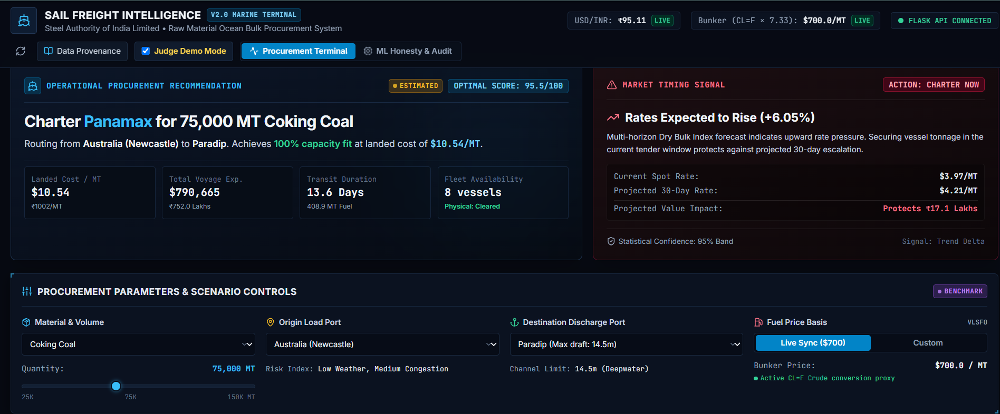
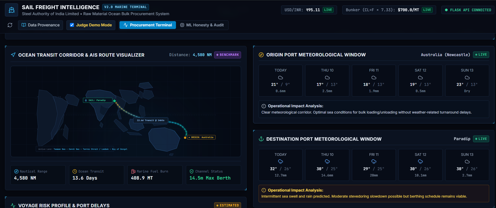
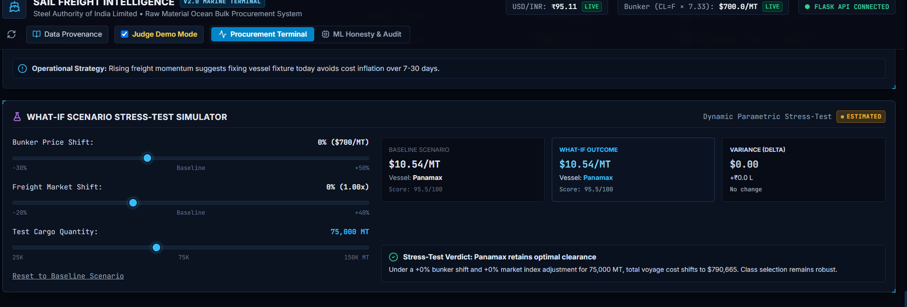

# 🚢 Freight Procurement Terminal

<div align="center">

[](https://sail-frieght-git-main-iamankitttt-2441s-projects.vercel.app/)
[](https://react.dev/)
[](https://www.typescriptlang.org/)
[](https://vitejs.dev/)
[](https://www.python.org/)
[](https://flask.palletsprojects.com/)

**🌐 Live Web Application:** [https://sail-frieght-git-main-iamankitttt-2441s-projects.vercel.app/](https://sail-frieght-git-main-iamankitttt-2441s-projects.vercel.app/)

*Vessel–port physical feasibility · voyage landed cost · market timing — powered by the Flask decision engine.*

</div>

---

> **Bulk ocean freight decision support for cargo owners** — East Coast India bulk import corridors (Newcastle, Hay Point, Samarinda, Maputo, New Orleans, Vladivostok → Paradip, Haldia, Vizag, Dhamra).
>
> *Origin: built for Smart India Hackathon 2026 (Steel Authority of India problem statement); now being productized for commercial sale — see [docs/COMMERCIALIZATION_PLAN.md](docs/COMMERCIALIZATION_PLAN.md).*

---

## 📌 What It Does

For a bulk parcel (coking coal, thermal coal, iron ore pellets, limestone) between a load port and a discharge port, the platform computes:

1. **Physical vessel–port compatibility** — vessels whose draft exceeds the discharge port's channel/berth limit are hard-flagged `INFEASIBLE` (e.g. no vessel class can berth at Haldia's ~8.5 m river channel). Physical feasibility always takes precedence over economics.
2. **Total landed cost per MT ($)** — charter hire + bunker fuel + port charges + canal fees (vessel-class-aware routing: Suez for Panamax-and-below, Cape of Good Hope for Capesize) + demurrage risk buffers, with a ₹ conversion and a transparent per-component breakdown.
3. **Market-timing support** — a 30-day freight-rate trend corridor with **empirically calibrated error bands** (walk-forward backtest displayed in-app) driving error-aware HOLD/WAIT vs CHARTER NOW signals, plus a what-if stress-test simulator (bunker shocks, freight swings, parcel resizing).

**Decision support only.** Every figure is provenance-badged (`LIVE / HISTORICAL / ESTIMATED / BENCHMARK / DEMO`); the terminal never presents an estimate as a market quote and never fabricates data when a feed is down.

---

## 📸 Terminal Interface Showcase

High-density, dark-mode maritime operations design system for procurement desks and logistics command teams.

### 1. Executive Procurement Recommendation

Instantaneous landed-cost evaluations, physical draft clearances, decision scoring, and error-aware market timing signals on live market feeds.



### 2. Ocean Transit Corridor & Port Meteorological Intelligence

Great-circle shipping corridors on real coastlines alongside 5-day meteorological windows for both load and discharge ports.



### 3. What-If Scenario Stress-Test Simulator

Bunker shocks, freight-market swings and parcel resizing against the baseline fixture — before committing the charter.



---

## 🏗️ Architecture

- **Backend** — Python/Flask REST API (`backend/`): deterministic procurement engine (`procurement/`), market data service, freight-trend forecast with measured accuracy, model audit. Production entrypoint: gunicorn.
- **Frontend** — React 18 + TypeScript + Vite (`frontend/`): industrial maritime terminal UI. Talks to the API at `VITE_API_URL` (defaults to same-origin `/api`).
- **Single source of truth** — all engine parameters (ports, routes, vessel specs, cargo profiles, cost constants) live in **`shared/engine_config.json`**, consumed by both the Python engine and the TypeScript what-if engine, so they cannot drift. Route distances are **self-derived** (great-circle × documented detour factors; Suez/Cape waypoint routing) by `shared/derive_distances.py`, which regenerates the config.

```
SIH-SAIL/
├── shared/                  # Single-source engine config + distance derivation method
├── procurement/             # Deterministic engine + unit tests
├── backend/                 # Flask REST API (auth, CORS allowlist, rate limiting, validation)
├── frontend/                # React + TypeScript + Vite terminal
├── ml/                      # ML training/evaluation scripts + datasets + reports
├── docs/                    # Commercialization plan, architecture, data provenance, model honesty
└── .github/workflows/ci.yml # CI: Python tests + frontend typecheck/build
```

---

## 🔐 Security Model

| Control | Behavior | Configuration |
|:---|:---|:---|
| API-key auth | When `API_KEYS` is set, every `/api/*` route except `/api/health` requires the `X-API-Key` header (issue one key per customer/tenant) | `API_KEYS=key1,key2` |
| CORS | Strict allowlist — no wildcard cross-origin, ever | `CORS_ALLOWED_ORIGINS=https://app.example.com` |
| Rate limiting | Sliding-window per key (or IP when unauthenticated), `429 + Retry-After` on breach | `RATE_LIMIT_PER_MINUTE=120` |
| Input validation | Finite-number bounds, known cargo types and routes enforced; `NaN`/`Infinity` rejected with 400 | built-in |
| Error hygiene | Internal exception text never reaches clients; logged server-side | built-in |
| Dev server safety | Flask debugger **off by default**; production must use gunicorn | `FLASK_DEBUG` (dev only), `backend/gunicorn.conf.py` |

See [.env.example](.env.example) for the full configuration surface.

---

## 🔬 Machine Learning Methodology & Honest Limitations

Models are evaluated with a leakage-free **chronological 70/10/20 split**, strictly lagged features, and a **zero-ML naive persistence baseline** — the audit is displayed live in the product:

| Model | Task | Test metric | Naive baseline | Status & Disclosure |
|:---|:---|:---:|:---:|:---|
| **Freight RF (naive-anchored)** | Freight ETF level, 1-day | $R^2 = 0.985$, RMSE `0.264` | RMSE `0.365` | 🟢 **Beats naive by 27.7%** (α=0.75; confirmed 5/5 folds in forward-chaining CV, +23–31%) |
| **Freight GB (naive-anchored)** | Freight ETF level, 1-day | $R^2 = 0.977$, RMSE `0.320` | RMSE `0.365` | 🟢 **Beats naive by 12.2%** (α=0.35) |
| **VLSFO Bunker model** | — | — | — | 🔴 **Quarantined**: legacy dataset failed the sanity gate (estimation R² −28 vs crude on the holdout); the terminal's bunker figure is a transparent crude-derived ESTIMATE |
| **Charter Direction Classifier** | 3-class, 5-day direction | Acc `33.6%` | Majority `48.5%` | 🟡 **No edge vs majority — excluded from decisions**; timing signals are transparent rate deltas |

Regressors predict only the *residual* against the naive forecast with a validation-tuned shrinkage factor — they deviate from persistence only where their pattern proved reliable. The bunker dataset quarantine and the classifier's losing record are published in-product (Methodology tab) because data governance is a feature. Details: [docs/MODEL_HONESTY_REPORT.md](docs/MODEL_HONESTY_REPORT.md), [docs/DATA_PROVENANCE.md](docs/DATA_PROVENANCE.md).

---

## 🚀 Getting Started

### Prerequisites
- Node.js 18+ & npm
- Python 3.10+ (tested on 3.12)

### A. Backend (Flask API)
```bash
pip install -r requirements.txt
python backend/run.py            # dev server on http://127.0.0.1:5000
```
Production:
```bash
gunicorn -c backend/gunicorn.conf.py backend.run:app
```

### B. Frontend
```bash
cd frontend
npm install
npm run dev                      # http://localhost:5173 (proxies /api to :5000)
npm run build                    # typecheck + production build
```
Environment (frontend): `VITE_API_URL` (API base, default same-origin `/api`), `VITE_API_KEY` (optional tenant key).

### C. Engine configuration
Edit `shared/engine_config.json` (ports, drafts, rates, cost constants) to match your fleet/lane reality, then re-run `python shared/derive_distances.py` if coordinates changed. Both engines pick up changes automatically.

---

## 🧪 Tests & CI

```bash
python -m unittest discover -s procurement/tests -t . -v   # engine tests (14)
python -m unittest discover -s backend/tests -t . -v       # API + security tests (18)
```
**32 tests total** — engine feasibility/cost math, vessel-class routing (Suez vs Cape), canal-lane logic, input validation (NaN/bounds/unknown cargo), API-key auth, CORS allowlist, rate limiting, forecast backtest integrity, and mocked market endpoints (no live network in CI). GitHub Actions runs both suites plus the frontend typecheck/build on every push/PR.

---

## 📈 Commercialization

The path from hackathon prototype to sellable product — market analysis, data-licensing gate, security requirements, roadmap (v1.0 → v2.0), target pricing, and go-to-market — is documented in **[docs/COMMERCIALIZATION_PLAN.md](docs/COMMERCIALIZATION_PLAN.md)**. Data sources and their licensing status: **[docs/DATA_PROVENANCE.md](docs/DATA_PROVENANCE.md)**.
